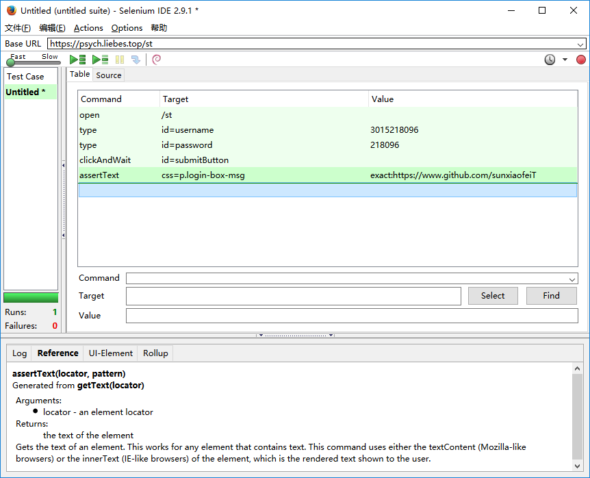
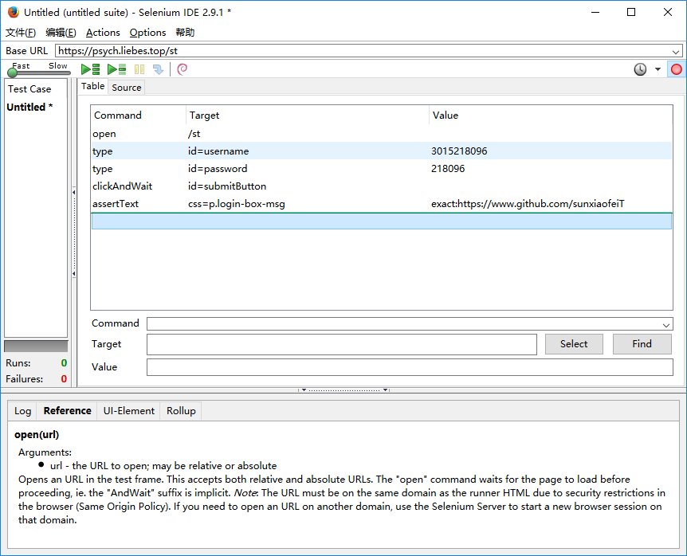
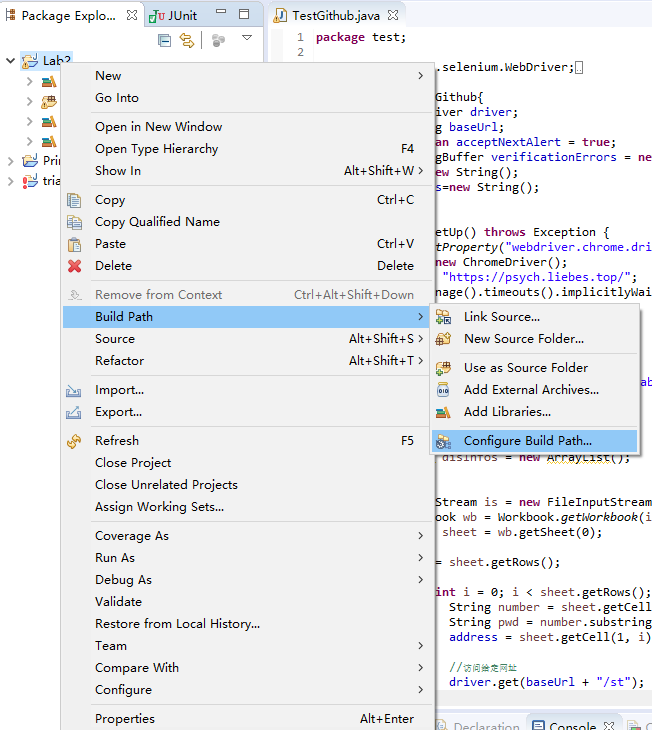
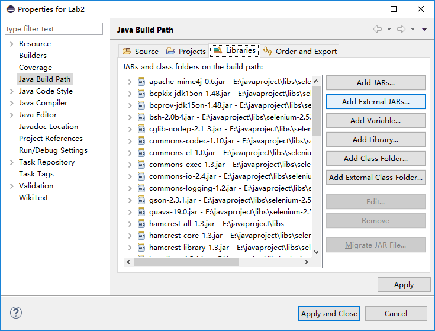
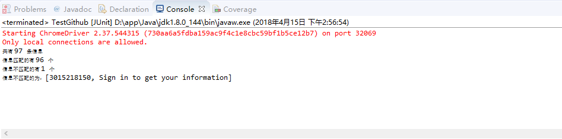

# 使用Selenium & webdriver 自动化测试 WEB
软件测试-Lab2

## SeleniumIDE 安装与使用

### 安装插件
-	下载 [火狐浏览器V42]( http://ftp.mozilla.org/pub/firefox/releases/42.0/win64/zh-CN/)
-	安装 [SeleniumIDE插件]( https://addons.mozilla.org/zh-CN/firefox/addon/selenium-ide/versions/) 选择对应版本


### 使用SeleniumIDE录制和导出脚本

1.	打开插件SeleniumIDE,访问网址 [https://psych.liebes.top/st](https://psych.liebes.top/st)
2.	开始录制
    
3.	导出测试用例代码
    - 文件
    - Export Test Case As…
    - Java/Junit4/WebDriver
    

## 新建Java工程进行测试

1.	下载 [Selenium Java](http://selenium-release.storage.googleapis.com/index.html?path=2.53/)
2.	新建Java项目
3.	导入 Selenium Java 的jar包
4.	下载 [jxl](http://maven.ibiblio.org/maven2/net/sourceforge/jexcelapi/jxl/) (读取表格数据的jar包) 并导入
5.	导入 hamcrest。

### 导入 jar 包的方法：  

1.  
  

2.  


## 根据导出的TestCase 编写代码

- 使用下边的代码来设置 `webdriver`。

```java
System.setProperty("webdriver.chrome.driver","E:/学习资料/软件测试/lab2/chromedriver.exe");
```

## 结果

运行结果为：  

  

可以看到一共97条数据，其中有 `96` 条数据匹配， 有 `1` 条数据不匹配。  

查看给出的表格文件可知此学号对应的值为空，所以不匹配。  

成功。